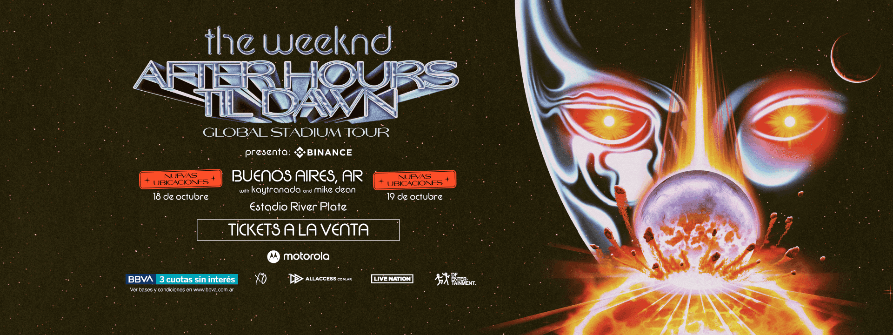
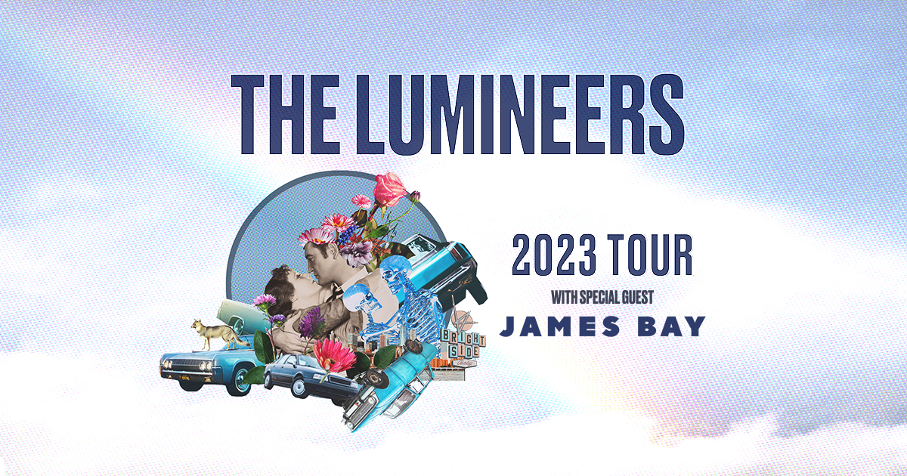

- 👋 Hi, I’m @agusimperiale
- 👀 I’m interested in ...
- 🌱 I’m currently learning ...
- 💞️ I’m looking to collaborate on ...
- 📫 How to reach me ...

<!---
agusimperiale/agusimperiale is a ✨ special ✨ repository because its `README.md` (this file) appears on your GitHub profile.
You can click the Preview link to take a look at your changes.
--->
<!DOCTYPE html>
<html lang="en">
    <head>
        <meta charset="UTF-8">
        <meta name="viewport" content="width=device-width, initial-scale=1.0">
        <title>YOURTICKET</title>
        <link rel="stylesheet" href="estilos.css">
    </head>
<body>
    <header>
        <h1>YOURTICKET</h1>
        

            <nav>
                <a href="../index/musica.html">Música</a>
                <a href="../index/familia.html">Familia</a>
                <a href="../index/teatro.html">Teatro</a>
                <a href="../index/deportes.html">Deportes</a>
                <a href="../index/ayuda.html">Ayuda</a>
            </nav>
        

        
    </header>
<main>

     
     <h2>Próximamente</h2>
     
     
     
     
     

     <h4>¡No te lo podés perder!</h4>

</main>
</body>
<footer>
    
</footer>

</html>
